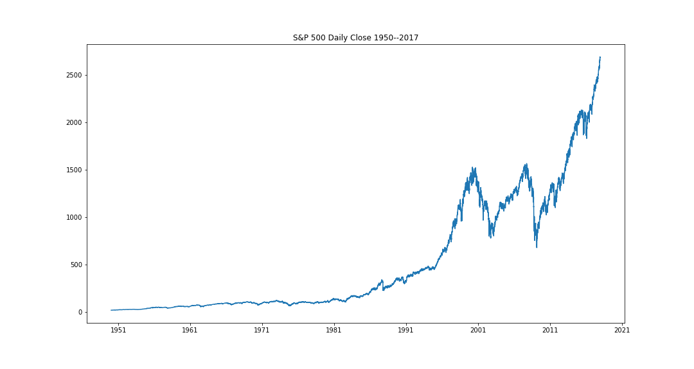
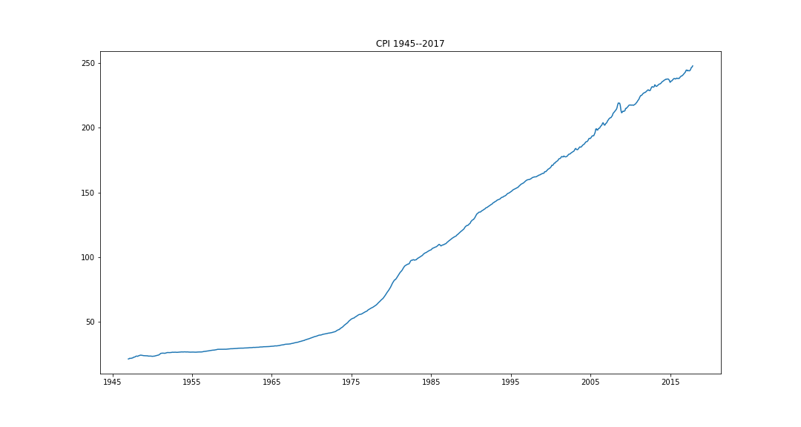
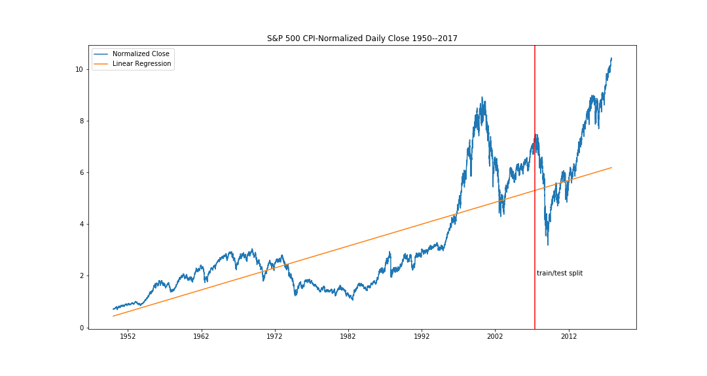
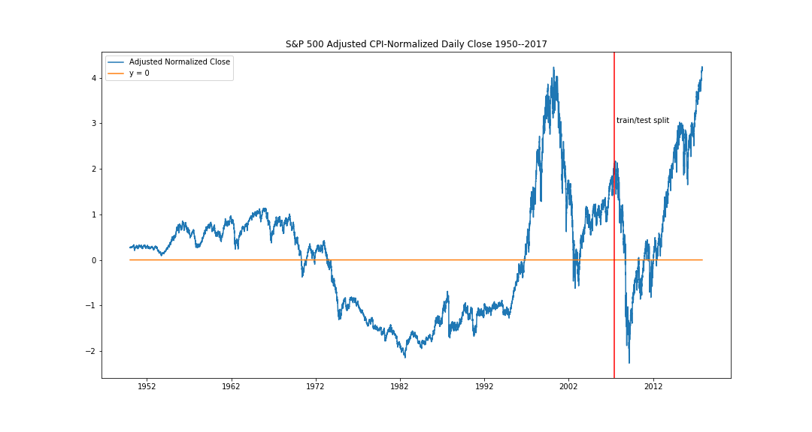

# Tensorflow LSTM

In this tutorial, we'll create an LSTM neural network using time series data (
historical S&P 500 closing prices), and then deploy this model in FastScore.
[An excellent introduction to LSTM networks can be found on Christopher Olah's blog.](http://colah.github.io/posts/2015-08-Understanding-LSTMs/)

## The Dataset

The model we're building will predict the closing price of the S&P 500, based
on previous days' closing prices. So, the primary dataset will be a collection
of daily S&P closing prices ([download it here](TODO TODO TODO)). Let's take a
look at this dataset.

First, import the necessary libraries:
```python
import pandas as pd
import matplotlib.pyplot as plt
import random
import datetime
import numpy as np
%matplotlib inline
```

Then, let's read in the data, make sure every price is indexed by date, and plot
it:
```python
sp500 = pd.read_csv('sp500.csv')

# Convert to Date
sp500['Date'] = pd.to_datetime(sp500['Date'])
sp500 = sp500.set_index('Date')

plt.figure(figsize=(15, 8))
plt.title('S&P 500 Daily Close 1950--2017')
plt.plot(sp500.index, sp500['Close'])
```



There's a small problem with this dataset: the price is expressed in dollars,
and the value of the dollar has changed over time. A reasonable proxy for the dollar
value is the consumer price index---let's rescale our S&P 500 closing prices by
this data. [The CPI dataset can be downloaded here.](TODO TODO TODO)

```python
cpi = pd.read_csv('CPIAUCSL.csv')

cpi['DATE'] = pd.to_datetime(cpi['DATE'])
cpi = cpi.set_index('DATE')

plt.figure(figsize=(15, 8))
plt.title('CPI 1945--2017')
plt.plot(cpi.index, cpi['CPIAUCSL'])
```



The CPI data is only reported monthly, whereas our S&P 500 data is reported daily.
To estimate the CPI on a particular day, linearly interpolate between the values:
```python
cpi = cpi.resample('B').asfreq().interpolate()
```

Now, we're ready to rescale by the CPI, and drop any missing values from our
dataset:
```python
sp500['Normalized Close'] = sp500['Close']/cpi['CPIAUCSL']
sp500 = sp500.dropna() # drop any missing values
```

Let's split the dataset up into training and test data by picking a date cutoff.
For this example, we'll pick June 1, 2007:
```python
split_date = datetime.date(2007, 6, 1)

training_data = sp500[:split_date]
test_data = sp500[split_date:]
```

A further normalization step we can perform for time-series data is to subtract
off the general linear trend (which, for the S&P 500 closing prices, is
generally positive, even after rescaling by the CPI). This is analogous
to recentering non-time-series data. The linear trend is easily computed with
`scikit-learn`:

```python
from sklearn.linear_model import LinearRegression

dates_to_array = lambda df: (df.index - df.index.min())/np.timedelta64(1, 'D')

sp500_linear_training_data = training_data['Normalized Close']
sp500_linear_training_dates = dates_to_array(sp500_linear_training_data)
linear_X = np.array(sp500_linear_training_dates).reshape(-1, 1)
linear_y = np.array(sp500_linear_training_data).reshape(-1, 1)

linear_reg = LinearRegression()
linear_reg = linear_reg.fit(linear_X, linear_y)
```

Here's a plot of the CPI-normalized data, the positive linear trend, and the
train/test split date:
```python
linear_preds = linear_reg.predict(np.array(dates_to_array(sp500)).reshape(-1, 1))[:,0]

plt.figure(figsize=(15, 8))
plt.title('S&P 500 CPI-Normalized Daily Close 1950--2017')
plt.plot(sp500.index, sp500['Normalized Close'], label='Normalized Close')
plt.plot(sp500.index, linear_preds, label='Linear Regression')
plt.axvline(x=split_date, color='r')
plt.text(split_date, 2, " train/test split")
plt.legend()
```



Generate our actual train and test data by subtracting off the linear regression's
predictions:

```python
sp500['Adjusted Normalized Close'] = sp500['Normalized Close'] - linear_preds
```

A plot of the train and test data is below.
```python
plt.figure(figsize=(15, 8))
plt.title('S&P 500 Adjusted CPI-Normalized Daily Close 1950--2017')
plt.plot(sp500.index, sp500['Adjusted Normalized Close'], label='Adjusted Normalized Close')
plt.plot(sp500.index, [0 for i in range(0, len(sp500))], label='y = 0')
plt.axvline(x=split_date, color='r')
plt.text(split_date, 3, " train/test split")
plt.legend()
```



## Generating Training Data

A standard approach when building a time-series model is to choose training instances
consisting of randomly selected sequences of fixed length, and the target sequence
for an input sequence is that same sequence shifted by one time step into the future.
For example, if the time series consists of values `[1, 2, 3, 4, 5]`, and we are
training a model to predict the next item in the series from the previous 3 items,
our model should map the input `[2, 3, 4]` to the output `[3, 4, 5]`.

We'll need to generate batches of such training inputs from our time series data,
so let's define a function to do so:

```python
def make_training_sequences(array, batch_size, n_steps = 30, seed = 2017):
    """
    Create batches of training data for the model. Sequences are time-ordered.
    """
    X_batch, y_batch = [],[]
    size = len(array)
    random.seed(seed)
    indices = sorted(random.sample(range(0, size - n_steps - 1), batch_size))
    for start in indices:
        x_slice = array[start:start + n_steps]
        y_slice = array[start + 1: start + n_steps + 1]
        X_batch.append(x_slice)
        y_batch.append(y_slice)
    return np.array(X_batch).reshape(-1, n_steps, 1), np.array(y_batch).reshape(-1, n_steps, 1)
```

This function accepts several inputs:

* `array` is the input time series data, as an array.
* `batch_size` is the number of training sequence pairs to generate.
* `n_steps` is the size of each sequence in the training sequence pair, i.e., the
  number of previous values the model should use to compute the next value.
* `seed` is a random seed to use. Fixing the seed will make training data
  generation reproducible.

## Implementing the Model in Tensorflow

With our input data scaled and normalized, and a function defined to generate
training data, we're now ready to build our model. Begin by importing Tensorflow:
```python
import tensorflow as tf
```

Let's specify the parameters of our model:

```python
n_steps = 30
n_inputs = 1
n_outputs = 1
n_layers = 3
n_units = 100
save_name = 'tf_sp500_lstm'
```

These variables control the topology of our neural net:

* `n_steps` is the number of previous data points to use when making a prediction.
  In this case, we have chosen 30, so our model will use the previous 30 business
  days' worth of adjusted S&P 500 close prices to predict the next one. This is
  also the number of stages in the "unrolled" neural net.
* `n_inputs` is the number of features in each input---in this case, just one (the
   adjusted closing price).
* `n_outputs` is the number of features in each output (also one, for the same
   reason).
* `n_layers` is the number of hidden layers in our neural net.
* `n_units` is the number of units in each LSTM cell in our model. This determines
  the number of neurons in the network.
* `save_name` is the filename we'll save our trained model to.

Now, let's initialize the model's graph:

```python
graph = tf.Graph()

with graph.as_default() as g:
    X = tf.placeholder(tf.float32, [None, n_steps, n_inputs])
    y = tf.placeholder(tf.float32, [None, n_steps, n_outputs])

    layers = [tf.contrib.rnn.BasicLSTMCell(num_units = n_units) for k in range(n_layers)]

    cell = tf.contrib.rnn.OutputProjectionWrapper(
      tf.contrib.rnn.MultiRNNCell(layers), output_size = n_outputs)

    outputs, states = tf.nn.dynamic_rnn(cell, X, dtype=tf.float32)

    saver = tf.train.Saver()
```

We'll train the model with the mean squared error (MSE) as our loss function,
using the Adam optimizer. The other parameters for the training process are the
learning rate, number of iterations, batch size, and the random seed for the
`make_training_sequences` function.

```python
seed = 2017
learning_rate = 0.001
n_iterations = 1500
batch_size = 100

with graph.as_default() as g:
    loss = tf.reduce_mean(tf.square(outputs - y))
    optimizer = tf.train.AdamOptimizer(learning_rate = learning_rate)
    training_op = optimizer.minimize(loss)

    init = tf.global_variables_initializer()

    with tf.Session(graph = graph) as sess:
        init.run()
        for iteration in range(n_iterations):
            X_batch, y_batch = make_training_sequences(training_data, batch_size, n_steps, seed)
            sess.run(training_op, feed_dict = {X: X_batch, y: y_batch})
            if iteration % 100 == 0:
                mse = loss.eval(feed_dict = {X: X_batch, y: y_batch})
                print(iteration, "\tMSE:", mse)
        saver.save(sess, './{}'.format(save_name))
```

With the settings above on a moderately powerful machine, the training process
takes ~5 minutes, and the model converges to a MSE of about 0.0016. The trained
model is saved to `tf_sp500_lstm`.

Generating predictions with the model is straightforward:

```python
def predict(inputs):
    """
    Make predictions based on the input inputs. If len(inputs) = n_steps, makes one prediction (the next item in the series).
    If len(inputs) < n_steps, doesn't make any predictions. If len(inputs) > n_steps, makes len(inputs) - n_steps + 1 predictions.
    """
    if len(inputs[0,:,0]) < n_steps:
        raise Exception("Insufficient inputs! X should be an array of shape (1, k, 1) where k >= n_steps")

    with tf.Session(graph = graph) as sess:
        saver.restore(sess, './{}'.format(save_name))

        preds = []
        steps_forward = len(inputs[0,:,0]) - n_steps + 1
        for j in range(0, steps_forward):
            X_in = inputs[:,j:j+n_steps,:]
            y_pred = sess.run(outputs, feed_dict = {X: X_in})
            preds.append(y_pred[0,-1,0]) # add the last one
    return np.array(preds).reshape(-1, len(preds), 1)
```

Let's define a function to plot the model's predictions:

```python
def plot_predict_date(date, data, steps_forward = 1):
    in_data = data[date:].iloc[0:n_steps + steps_forward - 1]
    true_data = in_data.iloc[n_steps - 1:]
    X_in = np.array(in_data).reshape(-1, len(in_data), 1)
    y_pred = predict(X_in)

    fig = plt.figure(figsize=(15, 8))
    plt.title("Predicted and Observed")
    plt.plot(true_data.index, true_data, label="Observed")
    mse = np.square(y_pred[0,:,0] - true_data).mean()
    plt.plot(true_data.index, y_pred[0, :, 0], label="Predicted (MSE: {})".format(mse))
    plt.legend(loc = "lower right")
    plt.xlabel("Date")
    plt.ylabel("Adjusted Price")
```

Here's what the predictions look like for the first 120 business days after July 1, 2007:

```python
plot_predict_date(datetime.date(2007,7,1), sp500['Adjusted Normalized Close'], steps_forward = 120)
```


We can also see how we did against all of the test data (the dates after June 1, 2007,
denoted by `split_date`).

```python
test_steps = len(sp500[split_date:])
plot_predict_date(split_date, sp500['Adjusted Normalized Close'], steps_forward = test_steps)
```


